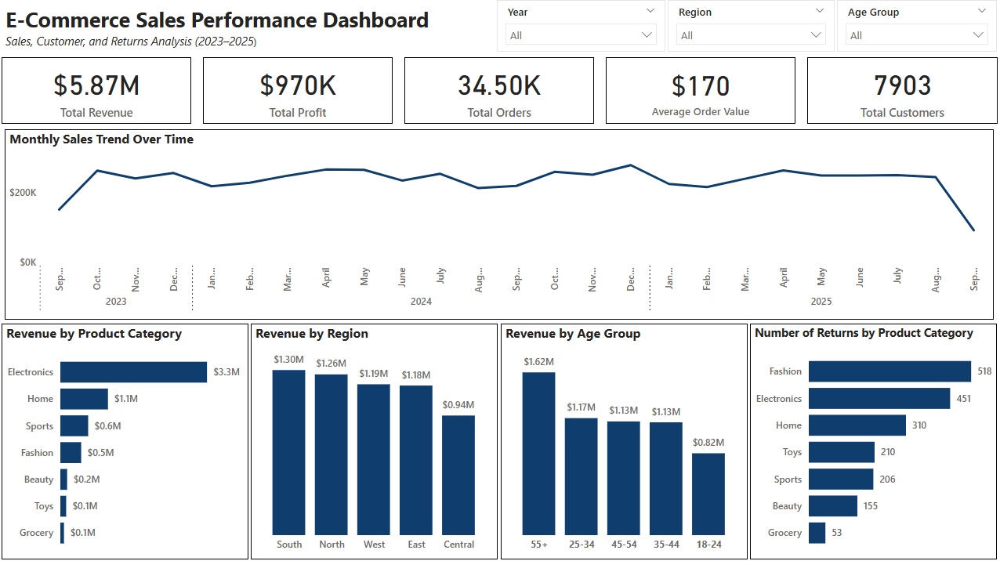

# 📊 E-Commerce Sales Dashboard 
#### *Exploratory Data Analysis and Interactive Dashboard using Excel and Power BI*

## 📌 Project Overview
This project analyzes an e-commerce sales dataset containing 34,500 transactions to explore sales performance, customer behavior, regional trends, and product returns using Excel and Power BI.

## 🎯 Business Problem
The goal of this analysis is to help an e-commerce business understand sales performance, customer behavior, and product trends to support data-driven decision-making.

## 🛠 Tools Used
- Microsoft Excel – exploratory data analysis
-	Microsoft Power BI – interactive dashboard visualization

## 💡Skills Demonstrated
- Data Cleaning & Preparation  
- Exploratory Data Analysis (EDA)  
- KPI Development  
- Data Visualization  
- Business Insight Generation

## 📂 Dataset Description
Dataset: [↪E-commerce Sales Transactions Dataset](https://www.kaggle.com/datasets/miadul/e-commerce-sales-transactions-dataset)  
Columns: 17  
Records: 34,500

## 📊 Dashboard Preview

## 📈 Key Insights
- December recorded the highest sales, while September had the lowest performance.  
- The South region generated the highest revenue, while Central had the lowest.  
- Electronics was the top-performing category, while Grocery had the lowest return rate.  
- Customers aged 55+ contributed the highest spending, while younger groups spent less.  
- The overall return rate was 6%, with Fashion having the highest returns.

## 🧠 Project Approach
This project followed a structured data analysis workflow:
1. Data Cleaning and Preparation  
2. Exploratory Data Analysis  
3. KPI Development  
4. Dashboard Creation  
5. Insight Generation  

Click to view detailed analysis

### Data Cleaning & Preparation
- Reviewed dataset structure and data types  
- Checked for missing, inconsistent, and duplicate values  
- Created an "Age Group" column for demographic segmentation  
- Prepared dataset for Excel-based analysis and Power BI visualization  

### Exploratory Data Analysis
- Calculated key performance indicators (Revenue, Profit, Orders, AOV, Customers)  
- Analyzed monthly sales trends  
- Examined revenue by category and region  
- Conducted customer demographic analysis  
- Evaluated product return rates  

### Dashboard
All key analyses were visualized in Power BI through an interactive dashboard designed to highlight performance trends, customer insights, and operational metrics.

### Findings
From **September 2023 to September 2025**, the business generated a **total revenue of $5.87M** with an overall **profit of $970K**, representing a **profit margin of approximately 17%**. This margin indicates a generally healthy level of profitability, suggesting that the business is able to maintain sustainable earnings while continuing to scale its sales operations.  
  
During the same period, the company recorded **34.50K total orders**, with an **average order value of $170**, coming from **7,903 unique customers**. These figures suggest that the business benefits from strong customer retention and a highly effective repeat-purchase engine, as a relatively moderate customer base is responsible for a large volume of transactions. This pattern indicates that existing customers are likely returning multiple times to make additional purchases, which is a positive indicator of customer satisfaction and product demand.  
  
Looking at the monthly sales trend, **revenue consistently peaks during November-December**, which is likely associated with the holiday shopping season when consumers increase their spending on gifts and seasonal purchases. In contrast, **September consistently records the lowest sales performance**. One possible explanation is that consumer spending tends to slow down after mid-year expenditures and before the start of the holiday shopping period. Additionally, fewer major promotional campaigns or seasonal buying triggers may occur during this month. To address this seasonal dip, the company could consider introducing targeted promotions or early holiday campaigns in September to stimulate demand and smooth the sales cycle.  
  
In terms of product performance, the **Electronics category generates the highest revenue** contribution. This is likely driven by the naturally higher price points of electronic products, which significantly increase revenue per transaction. Additionally, because the business operates in an e-commerce environment, customers may prefer purchasing electronics online due to the convenience of comparing specifications, reading reviews, and accessing a wider range of models.  
  
From a regional perspective, the **Southern region generates the highest revenue**, while the **Central region shows the weakest sales performance**. One possible explanation is that the Central region may be more urbanized and has greater access to physical commercial centers and electronics retail stores, leading customers to prefer buying these products in person rather than online. To improve performance in this weaker region, the company could explore region-specific promotions, faster delivery options, or localized marketing campaigns that highlight the convenience and price advantages of purchasing online.  
  
Customer spending patterns also reveal that individuals in the **55-and-above age group generate the highest total spending**. This suggests that the company’s most valuable customer segment may consist of older consumers with higher purchasing power and greater financial stability, who are able to make larger or more frequent purchases. This insight indicates that marketing strategies, product positioning, and user experience should consider the preferences and behaviors of this demographic group.  
  
The overall **product return rate stands at 6%**, with the **Fashion category accounting for the highest number of returns**. This pattern is consistent with common e-commerce challenges in apparel retail, where issues such as size mismatch, fit expectations, and differences between online images and actual products often lead to higher return rates.  
  
In conclusion, the business demonstrates healthy revenue growth, strong repeat purchasing behavior, and a loyal customer base, with Electronics and the Southern region serving as the primary drivers of revenue. However, opportunities exist to address seasonal sales dips, strengthen performance in underperforming regions, and reduce returns in the Fashion category. Moving forward, the company may benefit from targeted seasonal promotions, region-specific marketing strategies, and improved product information or sizing guidance for fashion items to further optimize performance and profitability.

## 📌 Recommendations
- Focus marketing efforts during high-performing months like November & December to maximize revenue  
- Improve performance in low-performing regions such as Central through targeted campaigns  
- Reduce return rates in the Fashion category by improving product descriptions or quality  
- Target older customer segments (55+) with premium offerings  

## 📬 Contact
If you have feedback, questions, or opportunities, feel free to connect with me:
- 🔗 LinkedIn: https://www.linkedin.com/in/jj-teston-b41950374/ 
- 📧 Email: johnjesterteston@gmail.com

